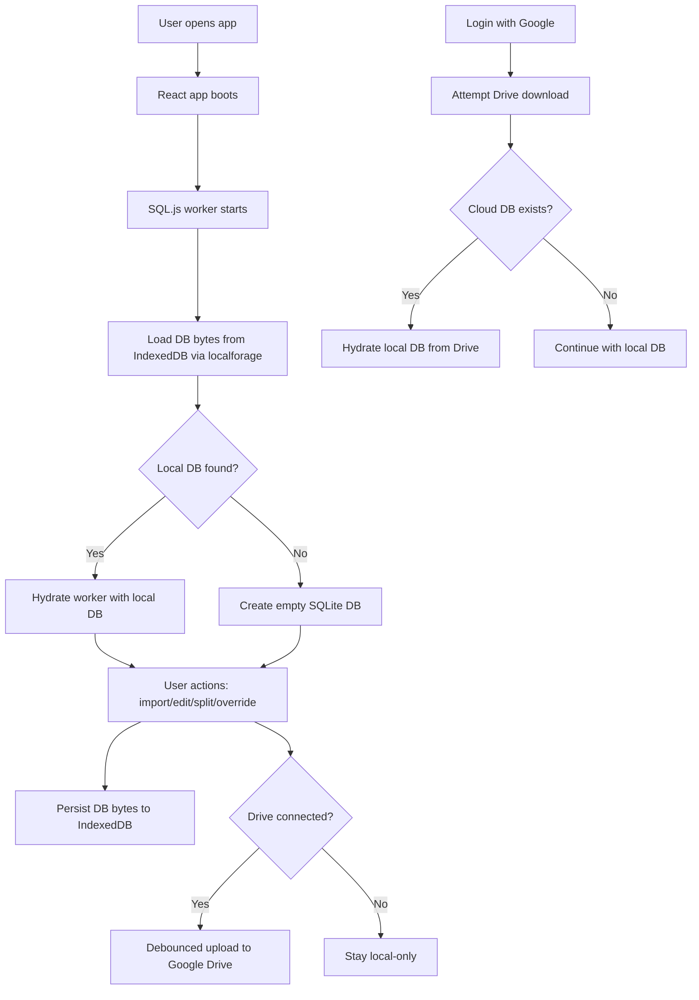

# BetterView Spending Tracker

## Overview
BetterView is now a local-first personal finance tracker.

Your canonical database lives in the browser (SQL.js in a Web Worker), is persisted locally, and is optionally synchronized to Google Drive as a portable SQLite file (`betterview_transactions.db`).

The app is now frontend-only and designed for resilient local usage with optional cloud backup/sync.

## Local-First Architecture

### Core data model
The transactions schema is SQLite-compatible and used across local browser and sync flows:

- `id` (INTEGER PRIMARY KEY AUTOINCREMENT)
- `date` (TEXT, ISO `YYYY-MM-DD`)
- `description` (TEXT)
- `amount` (REAL; expenses are negative)
- `account` (TEXT)
- `category` (TEXT)
- `source_file` (TEXT)
- `manual_override` (INTEGER nullable)
- `dedupe_group_key` (TEXT)
- `dedupe_source_amount` (REAL)
- `dedupe_source_date` (TEXT)
- `split_parent_id` (INTEGER nullable)
- `is_hidden` (INTEGER default `0`)

### Runtime flow
1. App starts and initializes SQL.js in `src/workers/sqlWorker.js`.
2. `DatabaseContext` loads previously saved DB bytes from browser storage (`localforage` / IndexedDB).
3. If available, DB bytes are hydrated into the worker and all queries/mutations run locally.
4. CSV imports, edits, split transactions, and overrides are written directly to the local DB.
5. After each mutation, DB bytes are persisted back to browser storage.
6. If Google Drive is connected, auto-sync uploads the DB after a debounce and on tab hide.

### Sync model
- Local copy is always the working copy.
- Drive copy is a backup/sync target.
- On sign-in, the app attempts to download the Drive DB and hydrate local state.
- Sync uses Google Drive `drive.file` scope and updates or creates `betterview_transactions.db`.

### Architecture diagram


## Project Structure
- `src/`, `public/`, and Vite config files at repo root: Primary app (React + Vite + SQL.js worker + Drive sync)
- `initial_transaction_data/`: Local sample/history files (do not commit personal exports)

## Tech Stack
- Frontend: React 19, Vite, TypeScript, Tailwind CSS, Recharts
- Local DB runtime: SQL.js + Web Worker + localforage
- CSV ingest: Papa Parse
- Optional sync: Google OAuth + Google Drive API

## Quick Start

### 1. App (primary local-first app)
From repo root:

```bash
npm install
npm run dev
```

Then open the local Vite URL (typically `http://localhost:5173`).

## CSV Import Behavior
The importer (`src/csvImporter.js`) currently supports Fidelity-style transaction/history exports and:

- strips preamble/footer noise
- normalizes dates/amounts
- filters excluded retirement accounts
- inserts with `INSERT OR IGNORE` against `(date, description, amount)`
- persists the updated DB to browser storage

## Data Safety Checklist
This repo handles sensitive financial data. Before pushing:

1. Keep all real CSV exports and SQLite DB files untracked.
2. Verify `.gitignore` still excludes `*.csv`, `*.db`, upload/archive folders, and personal exports.
3. If data files were staged previously, untrack them:
   - `git rm --cached *.csv`
   - `git rm --cached *.db`
   - `git rm --cached -r initial_transaction_data`
4. Validate before push:
   - `git status`
   - `git diff --staged`

## Notes And Current Constraints
- Google OAuth client ID is configured through `.env.local` using `VITE_GOOGLE_OAUTH_CLIENT_ID`.
- Login currently requires Google Drive connection before entering the dashboard.
- Browser storage is the source of truth during a session; Drive sync is eventual.

## Roadmap Direction
- Add conflict metadata/versioning for multi-device reconciliation.